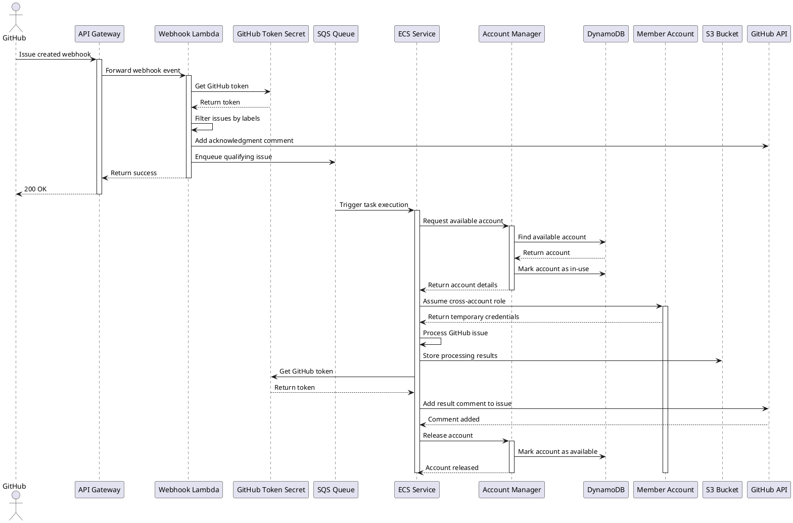
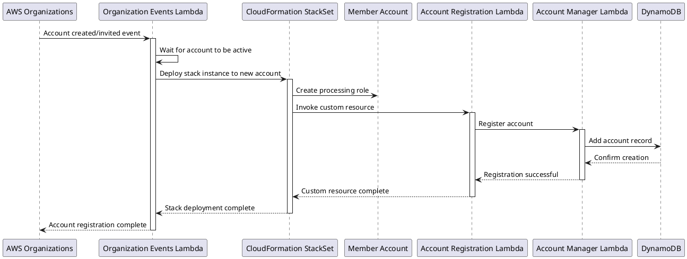
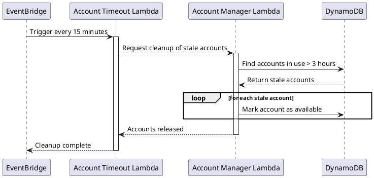
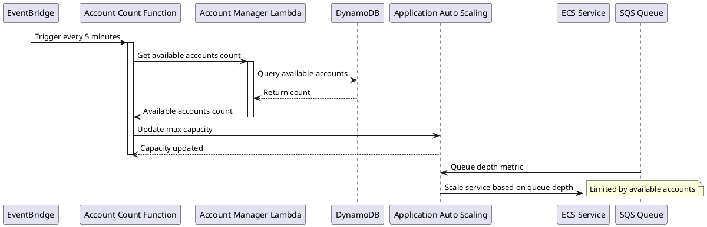

# GitHub Issue Processing Architecture

This project implements a scalable serverless architecture for asynchronous GitHub issue processing with cross-account capabilities using AWS CDK.

## Architecture Overview

```plantuml
@startuml Architecture Diagram
!define AWSPuml https://raw.githubusercontent.com/awslabs/aws-icons-for-plantuml/v16.0/dist
!include AWSPuml/AWSCommon.puml
!include AWSPuml/ApplicationIntegration/APIGateway.puml
!include AWSPuml/Compute/Lambda.puml
!include AWSPuml/ApplicationIntegration/SQS.puml
!include AWSPuml/Database/DynamoDB.puml
!include AWSPuml/Compute/ECS.puml
!include AWSPuml/Storage/S3.puml
!include AWSPuml/SecurityIdentityCompliance/SecretsManager.puml
!include AWSPuml/ManagementGovernance/Organizations.puml
!include AWSPuml/ManagementGovernance/CloudFormation.puml
!include AWSPuml/SecurityIdentityCompliance/IAM.puml

skinparam linetype ortho

rectangle "Management Account" {
  APIGateway(apiGateway, "GitHub Webhook API", "Receives webhook events")
  Lambda(webhookLambda, "GitHub Webhook Lambda", "Filters issues")
  SQS(issueQueue, "GitHub Issue Queue", "Buffers issues")
  DynamoDB(accountTable, "Account Management Table", "Tracks accounts")
  Lambda(accountManager, "Account Manager Lambda", "Allocates accounts")
  Lambda(accountTimeout, "Account Timeout Lambda", "Releases stale accounts")
  ECS(ecsCluster, "ECS Cluster", "Processes issues")
  S3(resultsBucket, "Results Bucket", "Stores results")
  SecretsManager(githubToken, "GitHub Token", "Securely stores token")
  CloudFormation(stackSet, "CloudFormation StackSet", "Deploys to member accounts")
  Lambda(orgEvents, "Organization Events Lambda", "Handles account lifecycle")
}

rectangle "Member Accounts" {
  IAM(crossAccountRole, "Processing Role", "Assumed by ECS tasks")
  Lambda(accountRegistration, "Account Registration", "Custom resource")
}

Organizations(awsOrg, "AWS Organizations", "Manages accounts")

github --> apiGateway : "1. Issue webhook event"
apiGateway --> webhookLambda : "2. Forwards event"
webhookLambda --> issueQueue : "3. Enqueues qualifying issues"
webhookLambda <--> githubToken : "Reads token"
issueQueue --> ecsCluster : "4. Triggers processing"
ecsCluster <--> accountManager : "5. Acquires/releases accounts"
ecsCluster --> crossAccountRole : "6. Assumes role"
ecsCluster --> resultsBucket : "7. Stores results"
ecsCluster <--> githubToken : "Reads token"
accountManager <--> accountTable : "Manages account state"
accountTimeout --> accountManager : "Releases stale accounts"
awsOrg --> orgEvents : "Account events"
orgEvents --> stackSet : "Deploys/removes stacks"
stackSet --> crossAccountRole : "Creates in member accounts"
crossAccountRole <-- accountRegistration : "Registers with Account Manager"
accountRegistration --> accountManager : "Registers account"

@enduml
```

The architecture consists of the following components:

1. **API Gateway + Lambda Frontend**: Webhook endpoint that receives GitHub issue events, filters them based on labels, and sends qualifying issues to SQS.

2. **SQS Queue**: Acts as a buffer for issues awaiting processing, allowing the system to scale based on load and handle backpressure.

3. **DynamoDB Account Management**: Centralized table to track available processing accounts across the organization, with timeout detection for stalled processes.

4. **Account Manager Lambda**: Single source of truth for account allocation with atomic operations for reserving/releasing accounts and automatic recovery of stale accounts.

5. **Account Timeout Lambda**: Background process that runs every 15 minutes to identify and release accounts that have been in use for over 3 hours.

6. **ECS Fargate Processing**: Container-based processing that scales automatically based on SQS queue depth and available accounts.

7. **AWS Organizations Integration**: New accounts are automatically registered to the processing pool via CloudFormation StackSets and custom resources.

8. **GitHub Token Secret**: Securely stores the GitHub API token in AWS Secrets Manager.

## Sequence Diagrams

### GitHub Issue Processing Flow



### Account Registration Flow



### Account Timeout Flow



### Auto-Scaling Flow



## Key Features

- **Fault-tolerant**: Multiple layers of protection against stuck accounts, failed tasks, and processing errors.
- **Cost-efficient**: No idle resources, with auto-scaling based on actual load.
- **Horizontally scalable**: Limited only by the number of available accounts.
- **Cross-account capabilities**: Assumes roles in other accounts to perform operations.
- **Automatic account management**: Accounts are automatically registered and deregistered.
- **Secure token management**: GitHub tokens stored in AWS Secrets Manager.

## Deployment

### Prerequisites

- AWS CDK installed
- AWS CLI configured with appropriate permissions
- Node.js and npm installed
- AWS Organizations set up with member accounts
- GitHub token (for commenting on issues)

### Deployment Steps

1. Install dependencies:

```bash
npm install
```

2. Update the `bin/cdk-github-bug-reproducer.ts` file with your AWS Organizations ID:

```typescript
// AWS Organizations ID - replace with your actual Organizations ID
organizationId: 'o-xxxxxxxxxx',
```

3. Store your GitHub token in AWS Secrets Manager:

```bash
aws secretsmanager create-secret --name github-issue-processor/github-token --secret-string '{"token":"your_github_token"}'
```

4. Deploy the stack:

```bash
cdk deploy
```

## Usage

1. Use the API Gateway URL output to configure a GitHub webhook for your repository.
2. Configure the webhook to send issue events.
3. New accounts added to your organization will automatically be registered for processing.
4. The system will automatically scale based on the number of issues and available accounts.

## Monitoring and Management

- Monitor the SQS queue depth to track processing backlog.
- Check DynamoDB for account status and allocation.
- Review CloudWatch logs for error tracking and debugging.
- Use the Account Manager Lambda to manually manage accounts if needed.

## Security Considerations

- The ECS tasks assume cross-account roles with least privilege permissions.
- All data is encrypted at rest and in transit.
- API Gateway can be configured with authentication for webhook security.
- Account timeouts prevent indefinite resource allocation.
- GitHub tokens are securely stored in AWS Secrets Manager.
- Cross-account permissions are restricted to specific roles within the organization.

## Customization

- Adjust the `REQUIRED_LABELS` environment variable to filter issues based on different labels.
- Modify the timeout duration in the Account Timeout Lambda.
- Customize the ECS task to perform different processing operations.
- Adjust auto-scaling parameters based on your workload characteristics.