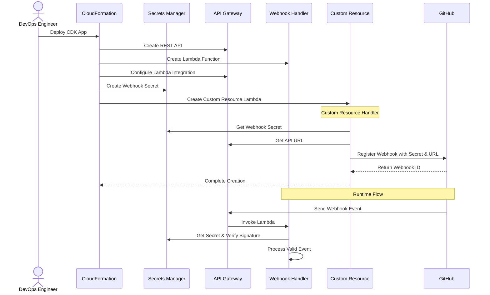
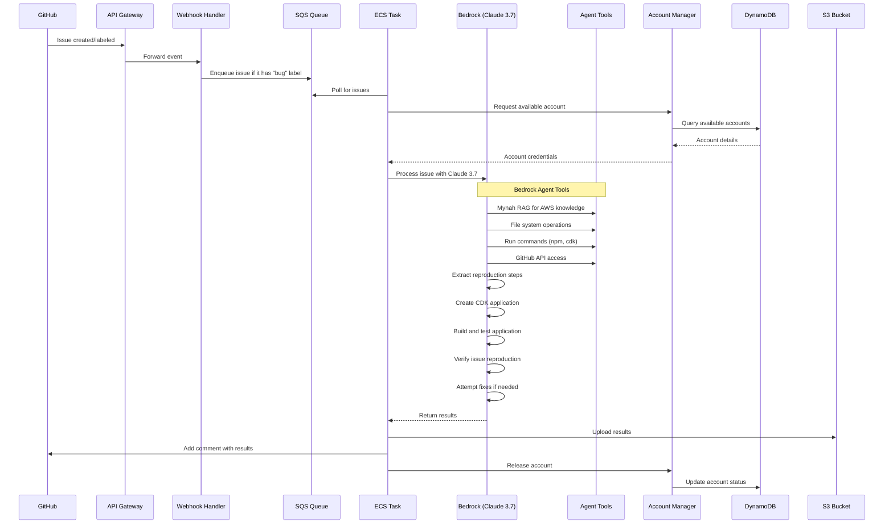
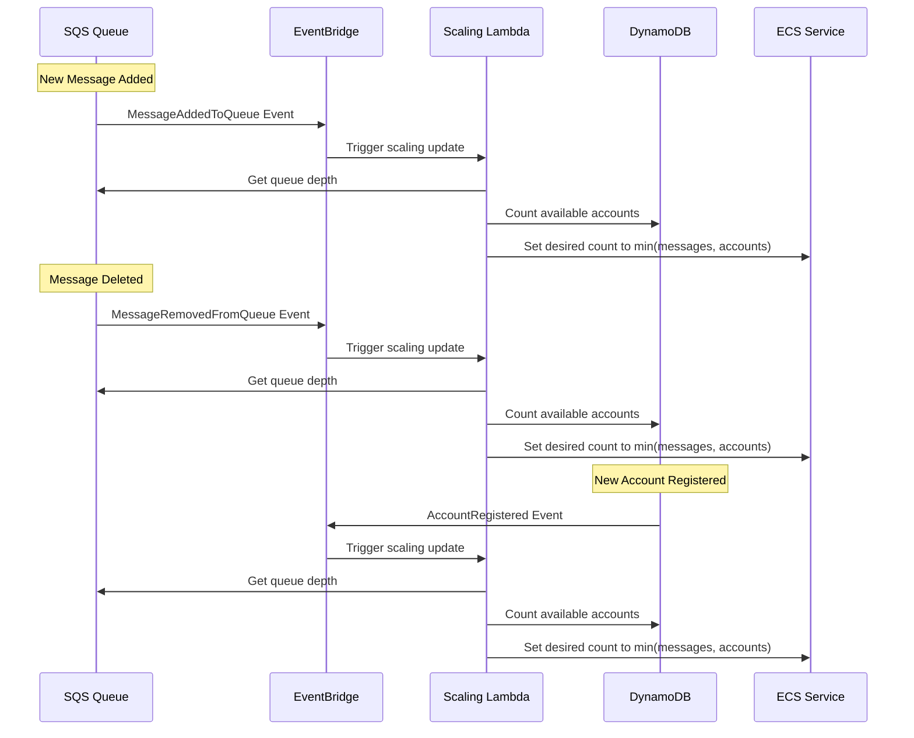
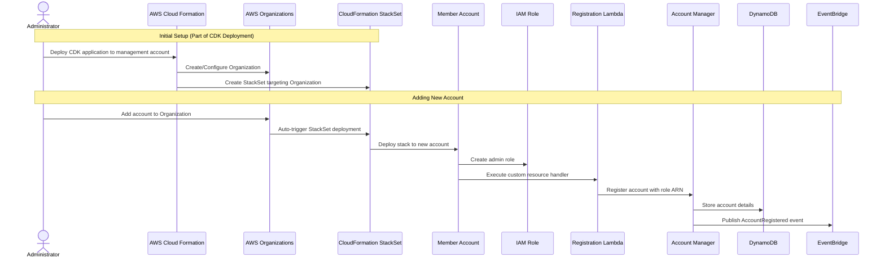

# CDK GitHub Bug Reproducer

Automated GitHub Issue Processing and Bug Reproduction

  
    Press Space for next page <carbon:arrow-right class="inline"/>
  

---
layout: default
---

# Introduction

<v-clicks>

- **Purpose**: Automate the reproduction of GitHub issues labeled as bugs in AWS CDK

- **Process**:
  - Monitor GitHub issues with "bug" label
  - Process issue content to understand the problem
  - Create a CDK application using the same language and version as reported
  - Verify if the application reproduces the issue
  - (Future) Test with latest CDK version to check if issue is fixed

</v-clicks>

---
layout: two-cols
---

# Application Workflows

<v-clicks>

## Key Workflows

1. Registering a GitHub webhook
2. Processing new GitHub issues
3. Scaling based on workload
4. Managing available accounts

</v-clicks>

::right::

<v-clicks>

## Architecture Highlights

- **Serverless-first approach**
- **Multi-account processing**
- **Event-driven architecture**
- **Auto-scaling components**
- **Cross-account role assumption**

</v-clicks>

---
layout: center
---

# Workflow 1: Registering a GitHub Webhook

<!--
Presenter Notes:

## Key Components

- **DevOps Engineer** deploys the CDK application through CloudFormation
- **CloudFormation** creates all required resources:
  - API Gateway REST API endpoint
  - Webhook Handler Lambda function
  - Secrets Manager secret for webhook verification
  - Custom Resource Lambda for webhook registration

- **Custom Resource** handles the GitHub webhook registration:
  - Retrieves the webhook secret from Secrets Manager
  - Gets the API Gateway URL
  - Registers the webhook with GitHub
  - Returns the webhook ID to CloudFormation

## Runtime Flow

- GitHub sends webhook events to the API Gateway endpoint
- API Gateway invokes the Webhook Handler Lambda
- Lambda verifies the webhook signature using the secret
- Valid events are processed and filtered for bug issues
-->

---
layout: center
---

# Workflow 2: Processing New GitHub Issues

<!--
Presenter Notes:

## Key Components

- **GitHub** sends webhook events when issues are created or labeled
- **Webhook Handler** filters for issues with "bug" label and enqueues them
- **ECS Task** processes issues using isolated accounts
- **Bedrock with Claude 3.7 Sonnet** powers the intelligent processing:
  - Analyzes GitHub issue content
  - Understands AWS CDK concepts and errors
  - Creates reproduction code
  - Tests and verifies issues

- **Agent Tools** provide capabilities to Claude:
  - **Mynah RAG**: Searches AWS knowledge base for service information
  - **File System Tools**: Create and modify local files for CDK app
  - **Command Execution**: Run npm, cdk synth, build commands
  - **GitHub API**: Access issue details and post comments

## Process Flow

1. **Issue Detection**:
   - GitHub sends issue events to API Gateway
   - Webhook handler filters for "bug" label
   - Qualifying issues are enqueued in SQS

2. **Issue Processing**:
   - ECS task acquires an available account
   - Claude 3.7 analyzes the issue using agent tools
   - Extracts reproduction steps from issue description
   - Creates a CDK application matching customer's language and version
   - Builds and tests the application
   - If reproduction fails, attempts to fix and retry
   - Verifies if the application reproduces the reported bug

3. **Results Handling**:
   - Uploads results and CDK app to S3
   - Comments on GitHub issue with findings
   - Releases the account back to the pool
-->

---
layout: center
---

# Workflow 3: Scaling Based on Workload

<!--
Presenter Notes:

## Key Components

- **EventBridge** receives events about queue and account changes
- **Scaling Lambda** calculates optimal capacity
- **ECS Service** scales tasks based on calculated capacity

## Event-Driven Scaling

- **Queue Events**:
  - When a new message is added to the queue
  - When a message is removed from the queue
  - EventBridge receives MessageAddedToQueue or MessageRemovedFromQueue events
  - Scaling Lambda is triggered to update capacity

- **Account Events**:
  - When a new account is registered
  - EventBridge receives AccountRegistered event
  - Scaling Lambda is triggered to update capacity

- **Capacity Calculation**:
  - Get current queue depth (number of messages)
  - Count available accounts in DynamoDB
  - Set ECS desired count to minimum of these values
  - Ensures we only run as many tasks as we have accounts or messages

- **Benefits**:
  - Real-time scaling based on actual demand
  - Efficient resource utilization
  - No over-provisioning of tasks
  - Immediate response to changes in capacity or workload
-->

---
layout: center
---

# Workflow 4: Managing Available Accounts

<!--
Presenter Notes:

## Key Components

- **CDK Application** deployed to management account sets up all infrastructure
- **AWS Organizations** manages the member accounts
- **CloudFormation StackSet** automatically deploys to all organization accounts
- **Member Accounts** receive infrastructure automatically
- **Account Manager** stores and manages account details
- **DynamoDB** tracks account status and information

## Process Flow

1. **Initial Setup (Part of CDK Deployment)**:
   - Administrator deploys CDK application to management account
   - CDK creates/configures AWS Organization
   - CDK creates StackSet targeting the Organization
   - All infrastructure for account management is deployed automatically

2. **Adding New Accounts**:
   - Administrator simply adds account to the AWS Organization
   - CloudFormation StackSet automatically deploys to the new account
   - Stack creates admin role for cross-account access
   - Custom resource automatically registers with Account Manager
   - No manual deployment or configuration needed

3. **Account Registration**:
   - Custom resource in each account calls Account Manager
   - Account details are stored in DynamoDB
   - Registration event is published to EventBridge
   - Scaling Lambda updates ECS capacity based on new account

4. **Benefits**:
   - Fully automated account onboarding
   - Zero-touch account registration
   - Consistent infrastructure across all accounts
   - Immediate availability for processing
-->

---
layout: end
---

# Thank You!

[GitHub Repository](https://github.com/QuantumNeuralCoder/cdk-github-bug-reproducer)